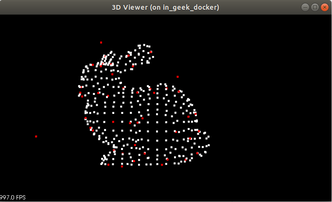

Python PCL Introduction For Geeks
============

This is a small python binding to the `pointcloud <http://pointclouds.org/>`_ library.
Currently, the following parts of the API are wrapped (all methods operate on PointXYZ)
point types

 * I/O and integration; saving and loading PCD files
 * segmentation
 * SAC
 * smoothing
 * filtering
 * registration (ICP, GICP, ICP_NL)

The code tries to follow the Point Cloud API, and also provides helper function
for interacting with NumPy. For example (from tests/test.py)

```python

    import pcl
    import numpy as np
    p = pcl.PointCloud(np.array([[1, 2, 3], [3, 4, 5]], dtype=np.float32))
    seg = p.make_segmenter()
    seg.set_model_type(pcl.SACMODEL_PLANE)
    seg.set_method_type(pcl.SAC_RANSAC)
    indices, model = seg.segment()
```
or, for smoothing

```python

    import pcl
    p = pcl.load("C/table_scene_lms400.pcd")
    fil = p.make_statistical_outlier_filter()
    fil.set_mean_k (50)
    fil.set_std_dev_mul_thresh (1.0)
    fil.filter().to_file("inliers.pcd")
```
Point clouds can be viewed as NumPy arrays, so modifying them is possible
using all the familiar NumPy functionality:

```python

    import numpy as np
    import pcl
    p = pcl.PointCloud(10)  # "empty" point cloud
    a = np.asarray(p)       # NumPy view on the cloud
    a[:] = 0                # fill with zeros
    print(p[3])             # prints (0.0, 0.0, 0.0)
    a[:, 0] = 1             # set x coordinates to 1
    print(p[3])             # prints (1.0, 0.0, 0.0)
```
More samples can be found in the `examples directory <https://github.com/strawlab/python-pcl/tree/master/examples>`_,
and in the `unit tests <https://github.com/strawlab/python-pcl/blob/master/tests/test.py>`_.

This work was supported by `Strawlab <http://strawlab.org/>`_.


## Quick start

1. Pull and build docker container on your local computer.
```bash
cd docker
bash start_geek.sh
```

2. Into docker container and run an example :

```bash

cd docker
bash into_geek.sh
# run example by keypoint
python3 examples/3dharris.py
```


